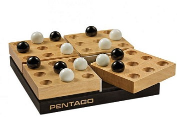

# A.I-Pentago
Pentago game between the player and A.I bot.

INSTRUCTIONS:

1.Click run and you will be prompted to choose a piece color either white or black
to select the color enter "w" for white or "b" for black

2.You will then be prompted to enter where you want to place a piece. Which you can do
by doing the following:

			4/4 2l

The first number represents the quadrant on the board. There are four quadrants to choose from therefore
you use 1-4. The second number represents the index within that quadrant. Each square has index from 1-9 
starting from top left going to bottom right in order. The third number represents the rotation number followed by a letter which is either "l" for left rotation
or 'r' for right rotation

3. You can modify the AI search method by changing "searchMethod" variable to either "AlphaBetaPruning" or "MiniMax"
4. You can also modify the depth limit on the "maxDepth" variable

